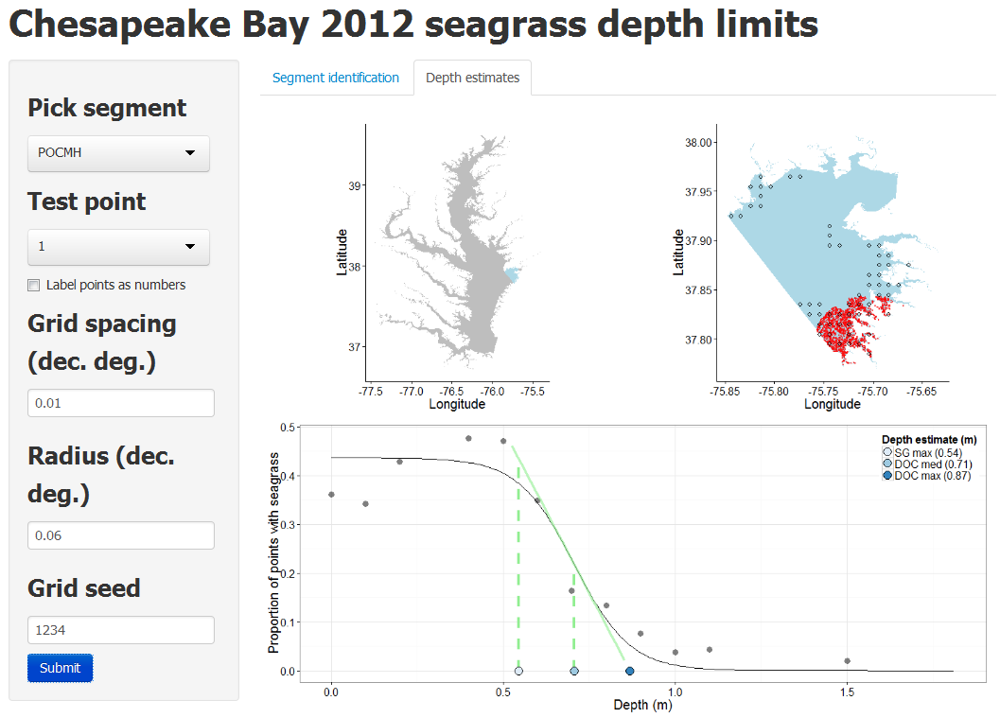

# README

Materials for seagrass depth of colonization estimates using a spatially-referenced approach, 2012 coverage data for Chesapeake Bay.  The web application is here.

# Screenshot

# Data

All spatial data are referenced to WGS 1984 geographic coordinate system. 

`cb_poly.shp` Chesapeake Bay boundary, the dissolved 2003 layer from [here](ftp://ftp.chesapeakebay.net/pub/Geographic/ChesapeakeBay/MonitoringSegments/)

`grid_polys.shp` buffered polygons of seagrass coverage, clipped and intersected with large segments in `sg_segs.shp` that contain seagrass.  Used to create sample grid for each segment.

`sg_segs.shp` Large segments containing seagrass, full coverage.  The forty largest segments were selected from the 2003 layer [here](ftp://ftp.chesapeakebay.net/pub/Geographic/ChesapeakeBay/MonitoringSegments/)

`sgpts.RData` An R data file created from a shapefile for faster loading.  Seagrass depth points used to estimate depth of colonization.  Created from a dissolved seagrass coverage layer (available [here](http://web.vims.edu/bio/sav/gis_data.html)) that was buffered by 1km.  Random points were created within the boundaries of the buffered layered.  The points were spatially joined with the original seagrass coverage layer and coded as being in or out of seagrass beds.  Finally, the points were used to sample a raster DEM layer (3 arc second, available [here](http://estuarinebathymetry.noaa.gov/bathy_htmls/M130.html)) to get depth locations.  All depths were converted to positive values and floored at zero.
